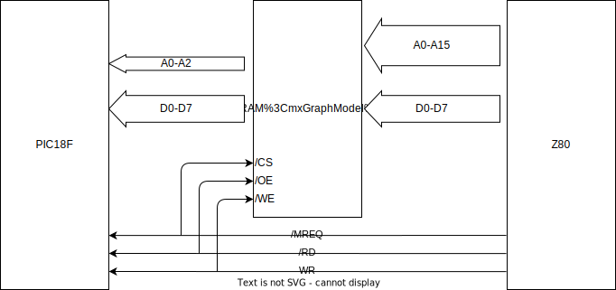

# Z80 3chip構成の整理

Z80をはじめとするレトロCPUを最近のマイコンで動作させる、そういうレトロPC野郎は古くから居たのだが、最近、EMUZ80の登場により一層火が付いたように思う。

私もZ80を動かすのが好きなのでいくつかの試みを行ってきたが、EMUZ80のCLC活用に感動し、また同好の士の活躍をTwitterで目にすることが多くなり、それらに刺激されて、PICを使った技をいくつか試みた。

EMUZ80はZ80とPIC18F47Q43の2チップだけが基板に乗っかっており、その美しさが魅力だと思っている。だが、2チップ構成の場合、Z80プログラムを載せるRAMの容量がPICの内蔵RAM容量に制限されてしまう。また、Z80のメモリアクセスごとにWAITを入れて待たせる、PICの実行速度の制約により数WAIT入ってしまう。実行速度上の限界が出てくる。

RAM容量の制約と実行速度の制約、この2つを打破するための方法の一つとして、2チップにSRAMを足して3チップ化するアプローチがある。私はこのアプローチに注力して基板を起こしファームを書き、現時点である程度の整理を得たように思う。そこで得たことをここに書き記しておこうと思う。

なお、現時点ではSDカード対応は未実装であり、MicroSoft BASICとASCIIART.BASを実行させて遊ぶ程度である。

## 試作基板を動かす

御託をあれこれ並べる前に、試作基板とそれを動かすための情報をまとめておく。

PIC/RAMの種類に応じて、RAM40(32pin DIP SRAM + 40pin PIC)と、RAM48(32pin SOP SRAM + 48pin PIC)の2種類がある。

### RAM40

* 回路図
* ファームウェア(HEXファイル)
* 基板イメージ
* ソースコード

### RAM48

* 回路図
* ファームウェア(HEXファイル)
* 基板イメージ
* ソースコード

ファームウェアのビルドには、[EMUZ80のリポジトリ](https://github.com/vintagechips/emuz80)をクローンして、その上に上記のソースファイル5つを上書きする。MPLAB X IDEで上記リポジトリのプロジェクトをオープンし、ファイル`xprintf.c`を追加する。これでファームウェアがビルドできる。

ビルドしたファームウェアはMPLAB SNAPを基板に接続し、それを使ってIDEから書き込む。添付のファームウェア(HEXファイル)を直接書き込む方法はよくわかっていない。申し訳ない。

USB-Serialと電源を接続し電源を投入する(電源SWをオンにする)。パイロットLEDが点灯し、Teratermにプロンプト`;`が出力される。

本ファームウェアはZ80コードは全く含んでいない。リセット後の`;`プロンプト状態で、都度、Z80用プログラムをアップロード->SRAMに展開後、Teratermから`...`(ピリオド3つ)を入力するとプログラム実行を開始する。

サンプルコードとして、`echo.X`を用いてキーボードのエコーバック動作を確認するとよい。次に、MS-Basicを起動して`ASCIIART.BAS`を実行するとよいだろう。MS-Basicは`msb.X`をアップロードする。そのあと、Teratermのシリアルポート設定画面を出し、文字ディレイ1ms, 行末ディレイ10msを指定後に、`ASCIIART.BAS`をドラッグアンドドロップでアップロードする。リターンをたたいたのち、`RUN`を実行するとマンデルブロ画像の描画が始まる。

## 2チップ構成と3チップ構成

Z80を2チップ構成で動作させる場合、RAM(Z80が実行するプログラムとデータの置き場)をPIC内蔵RAM上に置く。よって、Z80のメモリアクセスはPIC側のプログラム処理で対応する。このとき、 1アクセス処理(アドレスを読み取ってデータバスにデータを置く/データバスからデータを読み取る)に数us掛かるため、通常はZ80のメモリアクセスを長くする。WAIT信号を使うかクロックを落とすかである。

いずれにしても、PIC内部の「アドレスバスを読み取ってデータバスに書き出す/読み込む」時間はPICソフトの処理時間であり、数usからの大幅な短縮は難しい。通常、Z80を2.5MHzや4MHzで駆動するとメモリアクセスは1us以下で完了するため、「遅いなぁ」という感覚は抜けない。

また、PIC内部のRAM容量が8kBから12kB程度と限られており、CP/Mを動かすには足りない。

RAM容量の限界と速度の限界を打破するための方法として、SRAMチップを加えて3チップ構成とする方法がある。Z80プログラム実行中はZ80とSRAMアクセスという従来の方式に基づいて動作するために、高速なSRAMを使用することで20MHzでも問題なく動作する。また、128kBのSRAMが100円以下で買えるので、お財布にも優しく64kBシステムを実現できる。3チップなら秋月B基板+αのサイズに載るので、基板作成もお安くできる。

以下、容量64kB/クロック最大20MHz、シリアルポートとSDcard I/F対応の基板・システム実現を念頭に置く。EMUZ80の良さである秋月B基板サイズに少数チップ搭載という性質にもこだわり、基板サイズは100mm x 100mm に収まるように考える。

## 3チップ構成で考えたこと(実現したいこと・実現アイディア)

3chip構成にするのは高速化と大容量RAM化のためなので、具体的には128kB SRAMチップを搭載し20MHz駆動を目指す。明示していないが、秋月電子通商で手に入る安価なLSIを使うことは当然のこととして考えている。

|chip|種別|パッケージ|秋月型番|秋月価格|
|--|--|--|--|--:|
|PIC18F47Q43|PIC|40pin DIP|I-16591|370円|
|PIC18F57Q43|PIC|48pin QFP実装基板|I-15941|480円|
|HM678127UHJ-12|128k SRAM|32pin 1.27mmピッチSOJ|I-00582|70円|

※PIC18F57Q43は裸チップも秋月販売リストにあるが在庫切れで買えない状態が続いている。私はMouserにも裸チップを発注済だが、納期が来年1月とのこと。秋月で実装基板で買うのが一番早い。

この手のSBCの動作としては、SRAM上にZ80プログラムを展開し、展開後RESETを解除してZ80の実行を開始する。シリアルポートとディスクアクセスはPIC端子にシリアルI/FとSDcardを接続し、Z80のI/O命令をPICプログラムで処理することで行う。すなわち、ブートローディングとI/OデバイスエミュレーションがPICの役割となる。
* ブートローディング: Z80プログラムをRAM上に展開する。PIC内部のフラッシュメモリにROMイメージを焼いておき、起動後にそれをRAM上に展開することが普通だが、毎回シリアル経由でダウンロードする方が繰り返し手順が簡単になる。この方法で行く。
* Z80のI/Oデバイスエミュレーション: シリアルとフロッピーディスクエミュレーション。シリアル経由で母艦のTeratermウインドウで実行する。フロッピーディスクエミュレートは、SDcardにフロッピーディスクイメージファイルを置き、その内部への512 バイト単位でのアクセスとして実現する。SDcardはSPI経由での接続とする。

PICで動く「モニタ」はシリアル経由のアップロード(RAM上への展開)とZ80実行開始コマンド程度に抑えておく。

回路は単純に抑える。Z80, SRAM, PICの3チップでできるだけ頑張る。シリアルやフロッピーエミュレーションなどの機能はPICにとりこむだけでなく、PICのCLC機能を活用することで、従来なら外部で組んでいた SRAM /OE, /WE発生のためのゲート回路をPIC内部に収容することができ、余計なチップを使わずに済ませる。

CPU部は48pinまで用意する。DIP 600milならばZ80以外のCPUも将来載せることを想定している。

一列外側に1x20ピンソケットを両側に備える。奥江さんのメザニンボード的に拡張基板によりZ80以外のCPU動作も試みられるように。残念ながらコンセプトが違う(SRAMの位置が異なる)ので、奥江さんのメザニンボードは私の基板ではそのまま刺さらない。

電源ランプのほかに、LED 3つを挿す穴も用意している(Rev003以後に追加)。Z80の場合、RESET, BUSACK, HALTにつないである。これを見ていると、ブートロード状態、実行状態、HALT停止状態の区別が一目瞭然でよろしい。

## 2種類の基板

PIC18F47Q43 40ピンDIPを使う基板と、PIC18F57Q43 48ピンを使う基板の2種類を作成した。SRAMとの組み合わせも2種類あり、PIC18F47Q43とDIP32ピン128kB SRAMの組み合わせと、PIC18F57Q43と高速アクセスタイム15ns 32pin SOJ SRAM(HM678127UHJ-12)の組み合わせとした。前者を[EMUPU_RAM40](https://github.com/tendai22/EMUPU_RAM48/tree/main/EMUPU_RAM40), 後者を[EMUPU_RAM48](https://github.com/tendai22/EMUPU_RAM48/tree/RAM48)と呼ぶ。

## メモリアクセス

Z80のメモリアクセス対象はSRAMである。Z80のメモリリード・ライトサイクルに対してSRAMアクセスを提供する。

## I/O命令の実行

I/O命令はすべてPICが担当する。I/Oアクセスが実行されるとWAITサイクルに入りCPUを待たせておいて、PICのソフトウエアによりデバイス制御(シリアル読み込み/書き出し、SDカードセクタリードライト)を実行する。処理が完了したら/WAITを解除してZ80の処理を継続させる。

実現は、/IORQがアサートされると/WAITをアサートするようにする。ソフトでは間に合わないので、CLCのD-FFを用いて/IORQの下りエッジで/WAITがLになるようにしている。このあたりはEMUZ80と同じである。

## PICピンの割り当て

3チップ以外のチップを増やさないということは、PICのピンはZ80またはSRAMに直結するということになる。秋月電子通商からPIC18F47Q43(40pin DIP)と、PIC18F57Q43(48pin QFP)を入手することができる。

PIC18F47Q43のGPIOポートは、PA0-8, PB0-7, PC0-7, PD0-7, PE0-2の35本使うことができる。
* デバッガ2本: PB6,7
* シリアル2本: PA6,7
* データバス8本: PC0-7
* Z80制御信号11本: PA0-5, PE0-1, PD5-7
* SPI 4本: PD0-3
* TESTピン1本: PE2

これで28本、35本から差し引くとアドレスバスに割り当てる端子は7本しかない。実際にはPB6,7はアドレスバスとも兼用できるので最大9本割り当てできる。アドレスバスには8本割り当てる。

* アドレスバス8本(A0-A7): PB0-7

## SDカード用のPIC GPIO端子の割り当て

現在、SDカード用のSPI 4本は専用に割り当てている。が、方針を変更してデータバス端子と共用とすることを考えている。すなわち、SS以外の3本はデータバスと共通とし、MISOはSS(CS)がネゲート(H)のときはHi-Zとなるように3ステートバッファを噛ますという方針である。

これで、PDポートの端子が3本余る。

最新の基板(Rev003)は上記の方針変更の前に製造指示を出してしまっていたので、4本専用割り当てとなっている。別途、ジャンパを飛ばして3本共通方式で動作を確認しておく。

SPI 4本のうちSSを除く3本をデータバスと兼用して動作させることができているという報告が上がっている。Z80実行中はSSをネゲート(Hにする)しておき、MISOをHi-Zにすることで動作するとのことである。

以前SDカードについて調査した時は、SS\==HでSCLKに72パルスを加えるとSDカードはリセット状態に入り、初期化シーケンスを構成する特定のコマンド(CMD0)しか受け付けなくなると理解していた。今回、改めて、[SD Specifications Part 1 Physical Layer Simplified Specification Version 9.00 August 22, 2022](https://www.sdcard.org/downloads/pls/pdf?p=Part1_Physical_Layer_Simplified_Specification_Ver9.00.jpg&f=Part1_Physical_Layer_Simplified_Specification_Ver9.00.pdf&e=EN_SS1_9)を調査した。その結果、72パルスでリセット状態うんぬんの記載が一切見つからない。「電源投入後はIdle modeに入り、ここでCMD0を受けつける」の記載しか見つからなかった。よって、CSをHにしている限りはSDカードの動作には影響しないと判断し、3本共有+MOSIのHi-Z制御という方針で進める。

> 大昔のSDカードの場合、「CSをLにしてSCLKに72パルス加える」が有効なものが残っているかもしれない。安定して動作しない場合は観念して新しいSDカードを買ってください。

RAM40, RAM48のRev003基板について、SPI端子の割り当ては以下の表の通りになっている。

|SDcard信号|RAM40基板|RAM48基板|
|--|--|--|
|SS|RD3|RB0|
|MOSI|RD2|RB1|
|MISO|RD1|RB2|
|SCLK|RD0|RB3|

3本共通とする場合、データバスD0-D2を使用する。両基板ともRC0-RC2を割り当てる。SS端子は専用のままである。

|SDcard信号|RAM40基板|RAM48基板|
|--|--|--|
|SS|RD3|RB0|
|MOSI|RC0|RC0|
|MISO|RD1|RC1|
|SCLK|RD2|RC2|

実現する場合、SDcardアダプタのMISO端子に3ステートバッファを噛ませて、SS==Hの時はMISOからの出力をHi-Zにするようにしておく必要がある。このあたりは別途説明する。

回路図(PIC端子割り当て)上のPIC端子順に合わせて配線した結果、RAM40基板とRAM48基板とで昇順が逆順になってしまっている。みっともないが、SPIモジュールとGPIOの割り当ての自由度は高いのでなんとかなるだろう。

## アドレスバス8本でSRAMにZ80プログラムを展開する方法

PICからSRAMにデータを書き込むには、SRAMのアドレスバスに書き込みアドレスを、データバスにデータを出力して、/CS, /WEをH->L->HとLパルスを発生させればよい。SRAMは64kB使用するので任意の場所に書き込むためにはアドレスバス16本にアドレスを出力する必要がある。EMUPU_RAM48ではA0-A15すべてがPICに接続されており問題ないが、EMUPU_RAM40はA0-A7の8本だけしかつながっておらず、先頭の256バイトしか直接アクセスできない。

では、アドレスバス8本だけでどうやって16本分と同じ働きをさせるのか?

PIC単独では無理である。一方、Z80はSRAMに対してアドレスバス16本すべてつながっている。とすると、Z80にアドレス、データを出力させ/MREQ, /WEにLパルスを送り込めばよい、というかこの方法しかない。

Z80にアドレスバス16本にアドレスを出力させるには、Z80にメモリ書き込み命令を実行させるしかない。Z80がメモリ書き込みサイクルを実行する、例えば、FA00h 番地に C3を書き込もうとする場合、

```
0000 21 00FA   LD HL, FA00h
0003 36 C3     LD (HL), C3h
```
という2命令をZ80に実行させればよい。具体的には以下の2つの方法が考えられる。

1. 0番地から順に上記5バイトを置き、リセット後にZ80命令実行を開始させる。
2. リセット解除後最初のインストラクションフェッチでSRAMからのデータ出力を邪魔してPICがデータバスに上記5バイトを順に置いてゆく(命令置き)。

命令置きのためには、メモリアクセスサイクルでWAITを掛けるだけでなく、メモリリードサイクルで、SRAMの/CSまたは/OEを「切る」必要がある。両信号のいずれかをHにする必要がある。

直接接続、すなわち、Z80とSRAMの間で、/MREQ-/CS, /RD-/OE, /WR-/WEを直結している場合は、SRAMの/CEまたは/OEを切ることはできない。よって、方式1で進めるのみとなる。

方式1の場合、命令は5バイトなので、(実際には実行完了を知るためのOUT命令の追加2バイトも含め)7バイト分を直接アクセスでSRAMに置ければよい。Z80を/BUSRQでホールド状態にしておき、PICが/MREQ, /WRをコントロールして書き込む。直接書き込みが7バイトなので、A0-A2の3本はPICにもつなぐ必要がある。書き込んだ後、/BUSRQを解除し、/RESETを解除してZ80に命令を実行させる。実行が完了したらその後ろにOUT命令を置いておき、WAITを掛けて終了処理ののち、次のバイトの書き込み用の命令群をSRAMに置き、再度実行を開始する。

> この方法を突き詰めれば、A0,A1の2本つなぎで、0番地から3番地まで使えば実現できる。
> 0000 26 FA     LD   H, FAh
> 0002 76        HALT
> の2バイトを置いてリセット、実行、停止。
> 0000 2E 00     LD   L, 00h
> 0002 76        HALT
> の2バイトを置いてリセット、実行、停止。
> 0000 36 C3     LD   (HL),C3h
> 0002 76        HALT
> の3バイトを置いてリセット、実行、停止。
> とすればよい。HALTを置かないでも済むならA0の1本だけでよいのだが、さすがにそれは乱暴すぎるだろう。

<p style="text-align: center">
<br>
図1. 直接接続</p>

間接接続の場合は、SRAMの/OEを切ることができるので、命令置きが可能である。ライトサイクルではSRAMを有効にすること(逆にPICはデータバスに出力せずHi-Z状態になること)が必要になる。間接接続についてはあとで詳しく検討する。

今回の試作では1の方法を用いた。上記5バイトに加え、その後ろに実行完了を表す命令(IN命令を使っている)2倍とも含め0番地から7バイト置いてからリセットを解除している。これを1バイト書き込むごとに行っている。

この7バイトの書き込みはPICからアドレス出力している。よって、最低でもA0-A2の3本はPICのGPIOにつないでおく必要がある。今回は8本あるので十分間に合っている。

2はかの名作[Z80-MBC2](https://j4f.info/z80-mbc2)が採用している方法である。「SRAMの邪魔」は、SRAMの2本目のCSであるCS2端子をLにする。インストラクションフェッチとメモリリードサイクルはCS2をLにして邪魔をして、PICからデータバスにZ80に喰わせるデータを置く。メモリライトサイクルはSRAMの所望のアドレスへの書き込みなので、邪魔せず、CS2をHのままとしておく。

<p style="text-align: center">
<br>
図2. 直接接続(CS2制御)</p>

命令置きの場合、SRAMに7バイトを展開する必要もない。PICはアドレスバスを使う必要がなく、I/Oアドレス用途以外にアドレスピンをつないでおく必要もない。Z80-MBC2では徹底していて、PICにはアドレスバスは1本(A0)しかつながっていない([回路図](https://j4f.info/_media/z80-mbc2/a040618_sch.pdf))。この方式ならば40ピンPICも要らない、28ピンPICで試作したという報告も上がっている。

## 間接接続

Z80とSRAMの間の信号/OE, /WE をZ80 の/RD, /WRと直結せずに、PICに/OE, /WEをつなぐ方法もある。PICではCLCを2個用いて、Z80の/MREQ, /RDから/OE, /WEを発生する。

> このやり方は奥江さんに教えてもらいました([SuperMEZ80](https://github.com/satoshiokue/SuperMEZ80))。

<p style="text-align: center">
<br>
図3. 間接接続
</p>
 
この方法は、Z80がプログラム実行中もメモリアクセスを検出して待たせることができるので、いろいろ仕込みをいれる可能性があって楽しいのです。間接接続ならば命令置きも簡単に実現できます。/MREQアサートもWAIT発生条件に追加し、Readサイクルで/OEをアサートしないように(Hのままに)貼り付けておけばよい。

直接接続の場合は、SRAMがCS2を持つチップの場合、PICがCS2をコントロールすることでReadサイクルでSRAMを止めることができる。32ピンSRAMの場合、CSを2本持つものと1本しか持たないものがあるため、CSを2本持つSRAMを使い、かつ、CS2(31ピン)をPICのGPIO端子につなぐことで命令置きが実現できる。

話を間接接続に戻します。しかし、この方法ではSRAMの/OE, /WEがZ80が/RDを出してから50ns遅延することが分かった。実際に16MHzでは動作しない、SRAM /OEが間に合っていなかった。SRAMがデータを出力し始める時点でZ80はリードサイクルを終えてしまっていた。

間接接続でもクロック8MHz以下なら確実に動作するので、他のCPUをつないで動かすときには有益だろう。ということで、間接接続に切り替えることができるようにジャンパパターンを入れておいた(JP1,2,3)


